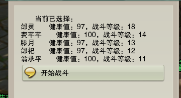
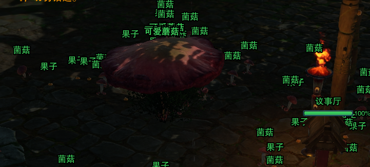
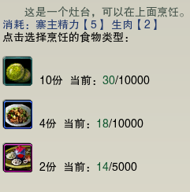
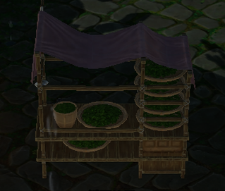
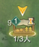

## 前言

适用于找dl/亲友肝到六级可以全自动的寨子

---

## 进入盘扎寨

主城寻找浪客行兑换商人【陈只鱼】，接受周常任务【经营盘扎】，点击进入盘扎寨。

### 操作栏

进入之后会出现如下两个操作栏

#### 第一个操作栏

一共六个图标

- 第一个：对寨民的互动，没啥用

- 第二个：显示可交互物品，没啥用

- 第三个：传送议事厅，需要操作的东西都摆在议事厅门口，点掉太虚buff进行传送。

- 第四个：暂停/开启运营，进的时候记得点点看看，把寨子保持在开启运营状态。

- 第五个：略过时间。
  - 这时要注意另一个操作栏也就是底色为灰色的时间段可以放心大胆地跳过，底色为黄色的时间段需要耗费道具【这东西在背包里，一定不能扔不能扔！！！】

- 第六个：派遣寨民对抗入侵，玉简的产出地。
  - 当dbm提示的时候，点击，选择再点击然后开始祈祷出玉简。

**如果没出，那下次一定。**

一点点注意事项：入侵事件大概1\~3天出现一次，所以最好不要一股脑把时间全都跳过。

#### 第二个操作栏

时间罗盘＋村寨管理，时间罗盘上面已经讲过，村寨管理打开可以管理各种寨子设施，但鉴于寨子已经六级全自动了所以意义不大可以不管

### 精力用来做啥好呢

做饭。为了避免浪费精力我一般只修一个膳房，所以饭是要自己搓一点的。

右上角可以看到食物条和精力值。生食，即果蔬、大米、生肉。三者均可在设施中产出，我已经修好了不用管设施。

地上的菌菇和果子，是果蔬类生食，没事可以捡着玩。捡一个耗费2点精力。

在议事厅门口找到：点击互动会出现

搓第二个或者第三个，开个按键尽量搓多点备用

如果觉得饭已经溢出了，那么可以找到这个茶艺工作台，开始搓茶叶。茶叶一般用来卖给商人，但后期不怎么缺钱，不搓也行。

### 商人

挂机时dbm常常会出现：

这是行脚商来到市场收购/卖货的通知，如果想去看看，打开村寨管理找到市场点击就ok了。不管他也没什么问题。

---

## 总结

1. 一句话总结：进入寨子→回到议事厅→开始挂机。

2. 灰色时间要跳过，有精力就搓饭。

3. 在寨子里也可以挂艺人，不影响互动，所以我的建议是

